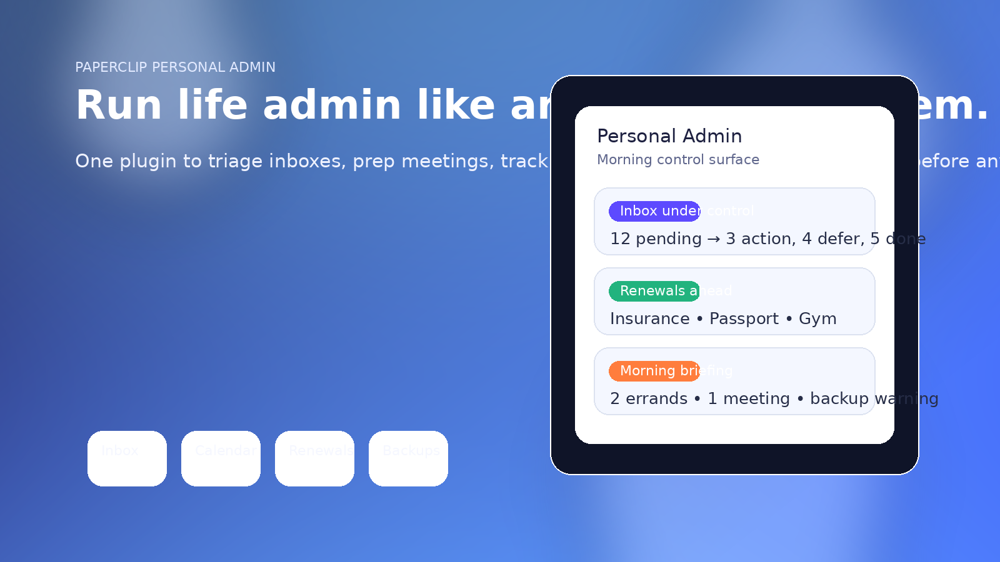
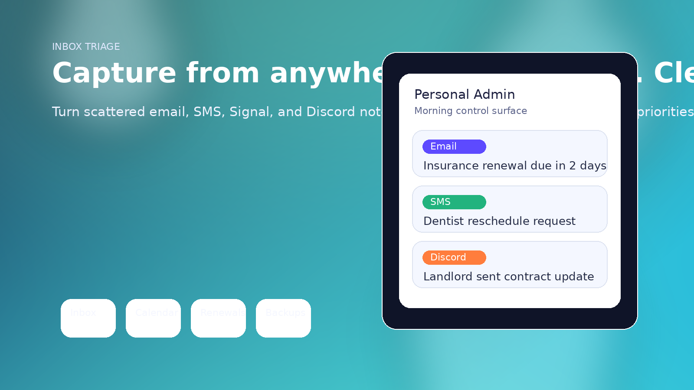
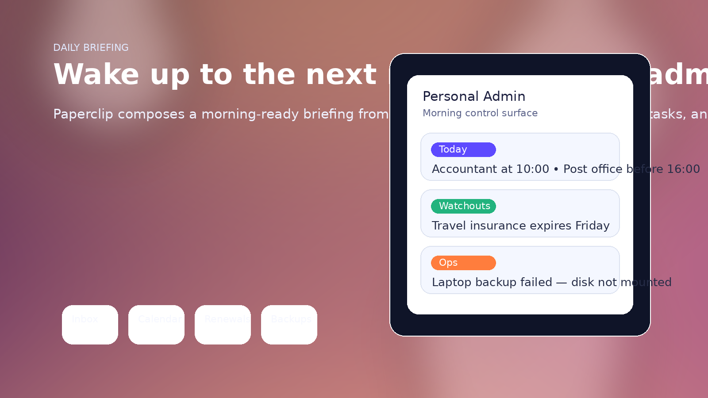

# Personal Admin for Paperclip

Turn messy life admin into an AI-operable system.

**Personal Admin** is a Paperclip plugin that gives one agent-friendly control layer for inbox triage, meeting prep, renewals, documents, subscriptions, errands, weekly reviews, cleanup work, and backup health. Instead of scattered reminders and half-finished notes, you get a single stateful admin surface that Paperclip can read, update, and brief you on.



## Why it matters

Personal admin work usually fails for boring reasons:

- important messages stay buried in different channels
- renewals and documents expire quietly
- errands never become a prioritized queue
- weekly reviews happen only when things are already on fire
- backups are assumed healthy until they are not

Personal Admin fixes that by giving Paperclip a durable, structured state model for everyday operations. The result is a plugin that feels less like a checklist and more like a lightweight operating system for personal upkeep.

## What you get

### 1. Inbox triage that actually clears the queue
Capture items from email, SMS, Signal, Discord, or anything else, then triage them into **action**, **delegate**, **defer**, or **done**.



### 2. Calendar prep that makes meetings useful
Store talking points, questions, and follow-up tasks for upcoming meetings, and link prep records to meeting entries so Paperclip can surface what matters before the call.

### 3. Renewals and document tracking before deadlines hit
Track subscriptions, policies, licenses, and important documents with dates, reminders, and health checks that can be summarized automatically.

### 4. Daily briefings with real operational value
Generate a morning-ready briefing from pending inbox items, active errands, meetings, renewals, cleanup work, and backup issues.



### 5. Weekly review support
Start and complete structured weekly reviews with wins, blockers, goals, and energy/habit scoring so Paperclip can keep the cadence alive.

## MVP feature surface

| Domain | What it supports |
| --- | --- |
| Inbox triage | Add, triage, list, and clear inbox items |
| Calendar prep | Add prep notes, link meetings, complete prep |
| Renewals | Add renewals, view upcoming, check overdue/upcoming items |
| Documents | Add documents, view expiring docs, renew tracked docs |
| Subscriptions | Add subscriptions, inspect spend, flag cancellations |
| Errands | Add, prioritize, list, and complete errands |
| Weekly reviews | Start, complete, and list review cycles |
| Daily briefings | Generate or enrich daily briefings |
| File cleanup | Track stale files and mark cleanup complete |
| Backup checks | Register targets, inspect due checks, record failures |

## Registered action keys

| Domain | Actions |
| --- | --- |
| Inbox | `admin.add-inbox-item`, `admin.triage-inbox-item`, `admin.get-inbox`, `admin.clear-inbox` |
| Calendar prep | `admin.add-calendar-prep`, `admin.get-calendar-prep`, `admin.prep-meeting` |
| Renewals | `admin.add-renewal`, `admin.get-renewals`, `admin.check-renewals` |
| Documents | `admin.add-document`, `admin.get-documents`, `admin.renew-document` |
| Subscriptions | `admin.add-subscription`, `admin.get-subscriptions`, `admin.cancel-subscription` |
| Errands | `admin.add-errand`, `admin.complete-errand`, `admin.get-errands` |
| Weekly reviews | `admin.start-weekly-review`, `admin.complete-weekly-review`, `admin.get-weekly-reviews` |
| Daily briefings | `admin.get-daily-briefing`, `admin.add-briefing-item` |
| File cleanup | `admin.add-file-cleanup-task`, `admin.get-file-cleanup-tasks`, `admin.complete-file-cleanup` |
| Backup checks | `admin.add-backup-check`, `admin.get-backup-checks`, `admin.run-backup-check` |

## Architecture snapshot

- **Runtime:** Paperclip plugin worker
- **Persistence:** instance-scoped plugin state
- **Automation:** ambient refresh on `agent.run.finished`
- **Build:** TypeScript + esbuild
- **Verification:** Vitest + Paperclip SDK test harness + smoke build test

## Local development

```bash
npm install
npm run plugin:typecheck
npm run plugin:test
npm run plugin:build
npm test
```

## Project structure

```text
src/constants.ts   action keys and state namespaces
src/types.ts       domain models
src/plugin.ts      plugin behavior and action registrations
src/worker.ts      worker entrypoint
src/manifest.ts    Paperclip manifest
tests/plugin.spec.ts   harness-backed integration tests
tests/smoke.mjs        built artifact smoke test
```

## Product pitch

If you want Paperclip to do more than chat—if you want it to **run the quiet operational layer of life**—this is the plugin. Personal Admin turns invisible maintenance into a tracked system with state, workflows, and daily visibility.

It is opinionated enough to be useful on day one, but simple enough to extend later with Gmail, Google Calendar, bank feeds, or Norwegian public-sector integrations.
