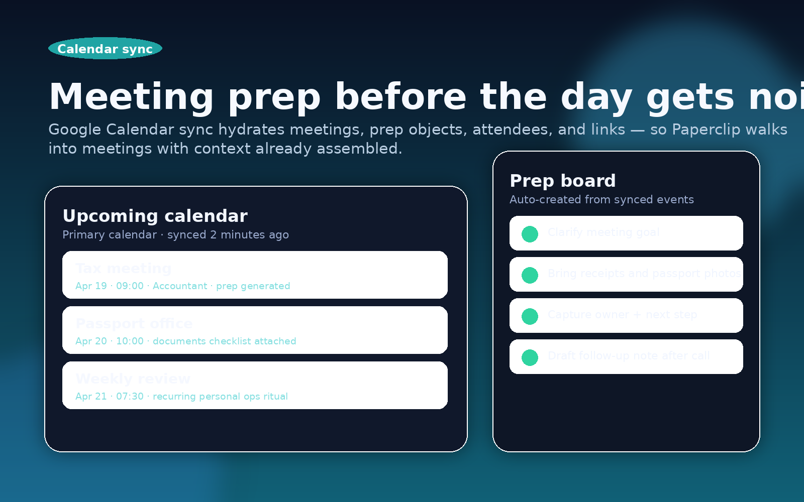

# Personal Admin for Paperclip

Run your life admin like an operating system — not a pile of reminders.

**Personal Admin** is a Paperclip plugin that turns Gmail, Google Calendar, renewals, errands, documents, subscriptions, cleanup work, and daily briefings into one integrated command center. It syncs real inputs, applies rules, generates prep, and gives Paperclip a durable operational surface it can actually use.


## Why this plugin is different

Most personal admin tools are passive. They store tasks, notes, or reminders — then wait for you to do the hard part.

Personal Admin is different:

- it **pulls live operational inputs** from Gmail and Google Calendar
- it **converts messages into triageable state**
- it **applies advanced rules** for mark-read, starring, archiving, defer logic, and optional guarded replies
- it **auto-builds meeting prep context** from upcoming calendar events
- it **keeps the operational layer visible** through a dashboard, widget, jobs, and briefings

This is not just a tracker. It is a **personal operations console for Paperclip**.

## What you get

### 1. Gmail that turns into an action system
Sync Gmail into a unified inbox state, then auto-triage with advanced rules that can:

- detect high-value senders or topics
- mark messages read
- star important threads
- archive low-value noise
- assign priority and triage status
- send a guarded rule-based reply when explicitly enabled


### 2. Google Calendar that creates prep automatically
Calendar sync does more than mirror events. It creates meeting records, surfaces upcoming work, and auto-generates prep objects that Paperclip can enrich with talking points, questions, and follow-ups.

### 3. One dashboard for life operations
The plugin ships with:

- a full **Personal Admin page**
- a **dashboard widget** for at-a-glance sync health
- a **sidebar entry** for quick access

You get current visibility into inbox pressure, meeting load, rule status, renewals, errands, and the latest briefing — all from one place.



### 4. Daily briefings with actual situational awareness
The morning briefing pulls together:

- pending inbox items
- upcoming meetings
- renewal deadlines
- cleanup tasks
- backup concerns
- current sync state

That means Paperclip can brief you from the same operational substrate it uses to take action.

### 5. The old admin chores still stay covered
Beyond Gmail and Calendar, Personal Admin still tracks:

- renewals
- important documents
- subscriptions and cancellation state
- errands
- weekly reviews
- file cleanup tasks
- backup checks

## Core feature surface

| Domain | What it supports |
| --- | --- |
| Gmail | Full sync, incremental sync, remote mark-read/star/archive, guarded reply support |
| Rules engine | Advanced matching on sender, subject, snippet, labels, unread state, tags, priority, and triage status |
| Google Calendar | Full sync, incremental sync, event storage, meeting hydration, prep generation |
| Inbox | Add, triage, list, clear, and operate on unified inbox items |
| Daily operations | Dashboard, widget, sidebar, jobs, and daily briefings |
| Renewals | Add renewals, inspect upcoming/overdue, mark reminder state |
| Documents | Add documents, inspect expiry, renew tracked docs |
| Subscriptions | Track spend, billing cadence, and cancellation state |
| Errands | Add, prioritize, complete, and review errands |
| Reviews | Start and complete structured weekly reviews |
| Cleanup + backups | Track cleanup tasks and backup checks |

## Registered action keys

| Domain | Actions |
| --- | --- |
| Inbox | `admin.add-inbox-item`, `admin.triage-inbox-item`, `admin.get-inbox`, `admin.clear-inbox` |
| Rules | `admin.upsert-rule`, `admin.delete-rule`, `admin.get-rules`, `admin.run-rules` |
| Gmail | `admin.gmail-full-sync`, `admin.gmail-incremental-sync`, `admin.gmail-reply` |
| Calendar prep | `admin.add-calendar-prep`, `admin.get-calendar-prep`, `admin.prep-meeting`, `admin.get-calendar-events` |
| Calendar sync | `admin.calendar-full-sync`, `admin.calendar-incremental-sync` |
| Renewals | `admin.add-renewal`, `admin.get-renewals`, `admin.check-renewals` |
| Documents | `admin.add-document`, `admin.get-documents`, `admin.renew-document` |
| Subscriptions | `admin.add-subscription`, `admin.get-subscriptions`, `admin.cancel-subscription` |
| Errands | `admin.add-errand`, `admin.complete-errand`, `admin.get-errands` |
| Weekly reviews | `admin.start-weekly-review`, `admin.complete-weekly-review`, `admin.get-weekly-reviews` |
| Briefing/orchestration | `admin.get-daily-briefing`, `admin.add-briefing-item`, `admin.get-sync-status`, `admin.sync-all` |
| File cleanup | `admin.add-file-cleanup-task`, `admin.get-file-cleanup-tasks`, `admin.complete-file-cleanup` |
| Backup checks | `admin.add-backup-check`, `admin.get-backup-checks`, `admin.run-backup-check` |

## Built-in agent tools

- `sync_gmail`
- `sync_calendar`
- `run_rules`
- `generate_briefing`
- `reply_to_email`

## Scheduled automation

- Gmail incremental sync every 10 minutes
- Calendar incremental sync every 15 minutes
- Daily admin refresh every morning
- Ambient briefing refresh after `agent.run.finished`

## Configuration

Use the plugin instance settings to provide:

- Google client ID
- Google client secret ref
- Google refresh token ref
- Gmail query + limits
- Calendar IDs + sync window
- Jobs toggle
- Rules toggle
- Guarded auto-reply toggle/signature

The plugin resolves secret references at runtime and never persists resolved secret values.

## Local development

```bash
npm install
npm run plugin:typecheck
npm run plugin:test
npm run plugin:build
npm test
```

## Project structure

```text
src/constants.ts      action keys, job keys, tool keys, state namespaces
src/types.ts          domain + integration models
src/google.ts         Google auth and Gmail/Calendar API helpers
src/plugin.ts         plugin behavior, sync flows, jobs, tools, data providers
src/ui/index.tsx      page, widget, and sidebar UI exports
src/worker.ts         worker entrypoint
src/manifest.ts       manifest, config schema, UI slots, jobs, and tools
tests/plugin.spec.ts  harness-backed integration tests
tests/smoke.mjs       built artifact smoke test
```

## Sales pitch

If you want Paperclip to do more than answer questions — if you want it to **operate the quiet maintenance layer of your life** — this is the plugin.

Personal Admin gives Paperclip live inbox input, live calendar context, a rules engine, stateful operational records, scheduled refresh jobs, and a real UI. It turns invisible upkeep into a system that can be read, run, and improved.


